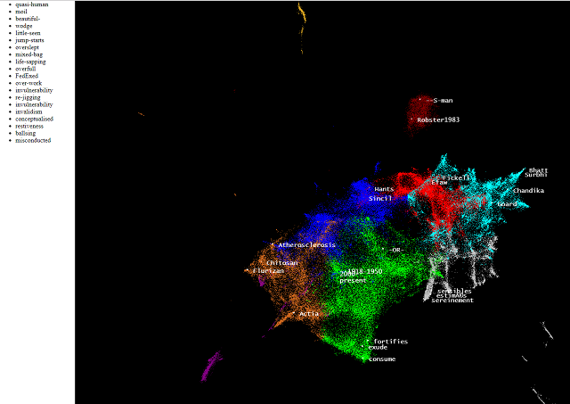

# 3dword2vec
3d plot of the Google word2vec model using the Uniform Manifold Approximation and Projection algorithm for
dimensionality reduction.

 

    Left mouse - rotate
    Right mouse - move model
    Mouse wheel - zoom
    WASD - was meant to move the camera but does weird things (for now)

Google makes a very large pre-trained word2vec file available, with 3m search phrases and each has 300 features (numbers). We use PCA and UMAP to reduce these features to 3 (x, y, z). You can then rotate/zoom the plot and mouse over dots to see the underlying search terms.

Note, we randomly sample a portion of the data because 3m is a bit much. This is governed by the SAMPLE_SIZE parameter and significantly affects the 3d data generation time.

# Install
Use pip (or your IDE) to install the relevant Python libraries (I'm using python 3 and PyCharm)

    pip3 install umap-learn gensim numpy

# Run
First run the python file which will download the Google word2vec model if necessary (first time run). This may take a while as it's 1.5GB.
Once downloaded we then generate the 3d point data that the graph needs.

    python w2v.py

If you already have the model file downloaded the output will look like:

    11:44:04.346393 Found word2vec model GoogleNews-vectors-negative300.bin.gz locally so no need to download
    11:44:04.346393 Loading model into memory...(a minute or so)
    11:45:47.328820 Sampling 15.0% the data...
    11:45:48.136003 Reducing data to 50 features using PCA...(few seconds)
    11:45:59.029194 Reducing data to 3 features using UMAP...(be patient)
    12:04:34.328662 Using KMeans to generate 10 groups so the final graph is prettier...
    12:04:57.411770 Writing data to coords-umap.txt...
    12:05:01.466036 Finished. Now open graphit.html

The output is a file called coords-umap.txt which is actually a JSON file.
You then open graphit.html with a browser (directly, no need to go a via webserver).

# Compare
For comparison here we use some different algorithms to generate the 3d data points. We also used a smaller sample (2%, about 60k phrases instead of 1m).

Here we're using PCA to reduce to 50 and then UMAP to 3. This is my favourite reduction as I think it accentuates certain branches.

 

Here we used PCA and t-SNE. You can see the separation but it still looks clumpy. t-SNE is slow to compute so starting with PCA speeds things up a bit.

  

Here we use just PCA, which is fast but not as pretty.

  

